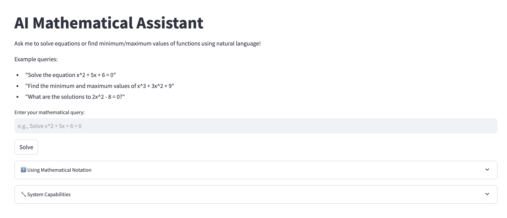
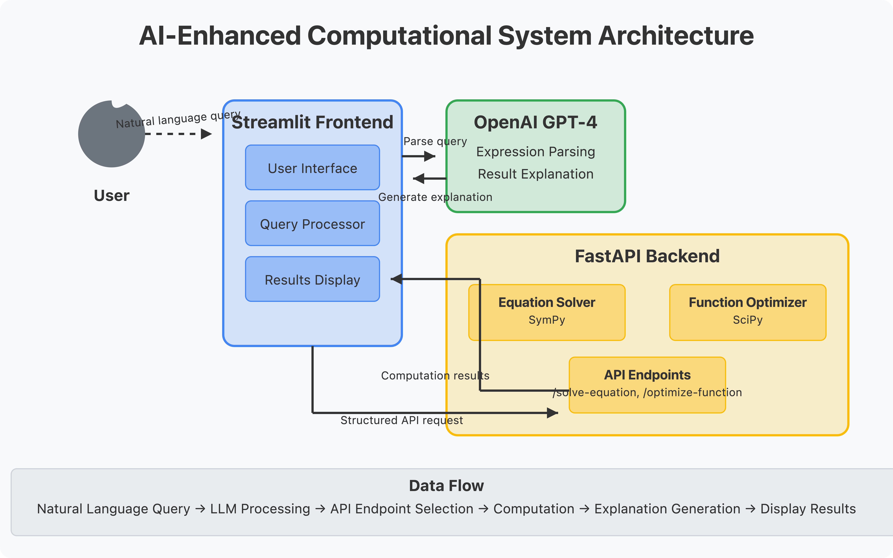

# AI-Enhanced Computational System

[](https://www.python.org/downloads/)
[](https://openai.com/index/hello-gpt-4o/)
[](https://fastapi.tiangolo.com/)
[](https://docs.streamlit.io/)
[](https://opensource.org/licenses/MIT)

A demonstration project showing how to integrate Large Language Models (LLMs) with specialized computational tools through API endpoints.



## 🧠 Concept Overview

This project demonstrates a key concept in modern AI systems: **Tools Augmentation**. By combining the natural language understanding capabilities of LLMs with specialized computational tools, we create a system that:

1. Understands natural language queries about mathematical problems
2. Routes those queries to the appropriate specialized computational tools
3. Returns results with AI-generated explanations

### The "Tools" Paradigm

In a tools-augmented AI system:

- **The LLM acts as a router and interpreter** - It understands user intent and determines which tool to use
- **Specialized tools handle domain-specific tasks** - Complex mathematical computations, in this case
- **The LLM provides context and explanation** - Making the results more accessible and educational

This approach overcomes the limitations of using LLMs alone, particularly for tasks requiring precise computation or specialized knowledge.

## 🚀 Features

- Natural language input processing using GPT-4
- LaTeX formatting for precise mathematical notation
- Symbolic equation solving using SymPy
- Numerical optimization using SciPy
- FastAPI backend with dedicated computational endpoints
- Streamlit frontend for user interaction
- AI-generated explanations of mathematical solutions

## 🛠️ System Architecture




The system follows a client-server architecture:

1. **Frontend (Streamlit)**
   - Provides user interface
   - Handles LLM communication for query parsing
   - Displays LaTeX-formatted mathematics
   - Presents AI-generated explanations

2. **Backend (FastAPI)**
   - Exposes computational endpoints
   - Handles symbolic computation (SymPy)
   - Performs numerical optimization (SciPy)
   - Returns structured results

3. **LLM Integration**
   - Parses natural language to structured queries
   - Routes requests to appropriate computational tools
   - Generates educational explanations of results

## 🔧 Installation

### Prerequisites

- Python 3.8+
- OpenAI API key

### Setup

1. Clone the repository:
   ```bash
   git clone https://github.com/sudhirnagendragupta/ai-math-system.git
   cd ai-math-system
   ```

2. Set up the backend:
   ```bash
   cd backend
   python -m venv venv
   source venv/bin/activate  # On Windows: venv\Scripts\activate
   pip install -r requirements.txt
   ```

3. Set up the frontend:
   ```bash
   cd ../frontend
   python -m venv venv
   source venv/bin/activate  # On Windows: venv\Scripts\activate
   pip install -r requirements.txt
   ```

4. Create an `.env` file in the root directory with your OpenAI API key:
   ```
   OPENAI_API_KEY=your-api-key-here
   ```

## 🚀 Running the Application

1. Start the backend (from the backend directory):
   ```bash
   uvicorn main:app --reload
   ```

2. Start the frontend (from the frontend directory in a new terminal):
   ```bash
   streamlit run app.py
   ```

3. Open your browser and navigate to: http://localhost:8501

## 🧪 Example Queries

Try these examples to see the system in action:

- "Solve the equation x^2 + 5x + 6 = 0"
- "Find the minimum and maximum values of x^2 - 4x + 3"
- "What are the solutions to 2x^2 - 8 = 0?"

## 💡 Core Concepts Illustrated

### 1. API Endpoints as Tools

Each computational capability is exposed as a dedicated API endpoint:
- `/solve-equation` - Handles symbolic equation solving
- `/optimize-function` - Performs numerical optimization

This design demonstrates how specialized tools can be modularized and accessed via well-defined interfaces.

### 2. LLM as Router and Interpreter

The system uses GPT-4 to:
- Parse natural language queries into structured data
- Identify the required computational tool
- Format the input appropriately for the tool
- Interpret and explain the results

### 3. Separation of Concerns

The architecture cleanly separates:
- **User interface** (Streamlit frontend)
- **Computational logic** (FastAPI backend)
- **Natural language processing** (LLM integration)

This separation allows each component to be developed, tested, and scaled independently.

## 🔍 Code Walkthrough

### Backend (FastAPI)

The `main.py` file defines our computational endpoints:

```python
@app.post("/solve-equation", response_model=ComputationResult)
async def solve_equation(input_data: EquationInput):
    # Uses SymPy to solve equations symbolically
    ...

@app.post("/optimize-function", response_model=ComputationResult)
async def optimize_function(input_data: FunctionInput):
    # Uses SciPy to find minimum and maximum values
    ...
```

Each endpoint takes structured input, performs specialized mathematical operations, and returns results in a standardized format.

### Frontend (Streamlit)

The `app.py` file handles:

1. User interface for input and display
2. Communication with the OpenAI API to parse queries
3. Sending structured requests to the appropriate backend endpoint
4. Displaying results and explanations

### LLM Integration

The `extract_math_expression` method demonstrates how to use the LLM as a query parser:

```python
def extract_math_expression(self, text: str) -> dict:
    """
    Uses GPT-4 to extract mathematical expressions from natural language
    and determine the computation type.
    """
    # Crafts a prompt to extract structured data from natural language
    ...
```

## 🛣️ Extension Ideas

Want to extend this project? Here are some ideas:

1. Add support for more mathematical operations:
   - Integration and differentiation
   - Systems of equations
   - Differential equations

2. Enhance the visualization capabilities:
   - Plot functions and solutions
   - Show step-by-step solution processes
   - Create interactive mathematical visualizations

3. Improve the LLM integration:
   - Fine-tune models for mathematical understanding
   - Add memory of previous calculations
   - Support multi-step problem solving

## 📚 Learning Resources

To learn more about the concepts demonstrated in this project:

- [FastAPI Documentation](https://fastapi.tiangolo.com/)
- [SymPy Documentation](https://docs.sympy.org/)
- [SciPy Documentation](https://docs.scipy.org/)
- [OpenAI API Documentation](https://platform.openai.com/docs/api-reference)
- [Streamlit Documentation](https://docs.streamlit.io/)


## 📄 License

This project is licensed under the MIT License - see the LICENSE file for details.

## 🙏 Acknowledgements

- OpenAI for GPT models
- SymPy and SciPy development teams
- FastAPI and Streamlit for simplified development

## 🤝 How to Contribute

We welcome contributions of all kinds to this open-source project!  Whether you're a seasoned developer, a budding coder, or just passionate about the project's goals, your help is appreciated.

Here are some ways you can contribute:

*   **Bug Reports:**  If you encounter any issues or unexpected behavior, please open a detailed issue on GitHub.  Clear bug reports are incredibly helpful!
*   **Feature Requests:**  Have a great idea for a new feature or enhancement?  Submit a feature request issue to discuss it with the maintainers and community.
*   **Code Contributions:**  Want to dive into the code?  We welcome pull requests for bug fixes, new features, improvements, and more!
*   **Documentation Improvements:**  Help make the project more accessible by improving the documentation, clarifying explanations, adding examples, or fixing typos.
*   **Testing:**  Help ensure the project's quality by writing tests, identifying edge cases, or participating in testing new features.
*   **Community Engagement:**  Participate in discussions, answer questions from other users, and help foster a welcoming and helpful community.

**Getting Started with Code Contributions:**

1.  **Fork the Repository:**  Start by forking the repository to your own GitHub account.
2.  **Clone Locally:**  Clone your forked repository to your local machine.
    ```bash
    git clone https://github.com/YOUR_GITHUB_USERNAME/YOUR_FORKED_REPO_NAME.git
    cd YOUR_FORKED_REPO_NAME
    ```
3.  **Create a Branch:**  Create a new branch for your contribution.  Choose a descriptive branch name related to your changes.
    ```bash
    git checkout -b feature/your-feature-name  # For new features
    git checkout -b fix/bug-fix-name         # For bug fixes
    git checkout -b docs/documentation-changes # For documentation
    ```
4.  **Make Your Changes:**  Implement your bug fix, feature, documentation update, etc.  Follow the project's coding style and guidelines (if any are specified).
5.  **Test Your Changes:**  Thoroughly test your changes to ensure they work as expected and don't introduce regressions. Add unit tests if applicable and if the project has a testing framework.
6.  **Commit Your Changes:**  Commit your changes with clear and concise commit messages explaining what you've done and why.
    ```bash
    git add .
    git commit -m "feat: Add descriptive feature or fix: Fix issue XYZ"
    ```
7.  **Push to Your Fork:**  Push your branch to your forked repository on GitHub.
    ```bash
    git push origin feature/your-feature-name
    ```
8.  **Create a Pull Request:**  Go to the original repository on GitHub and create a new pull request from your forked branch to the main branch of the original repository.

9.  **Code Review and Iteration:**  Be prepared to discuss your pull request, respond to feedback, and make revisions as needed.  Collaboration and code review are important parts of the contribution process.

**Guidelines for Contributions:**

*   **Keep it Focused:**  Each pull request should ideally address a single issue or feature.  Smaller, focused PRs are easier to review and merge.
*   **Code Style:**  Try to follow the existing code style of the project. If there are style guidelines, please adhere to them.
*   **Testing:**  Contributions that include tests are highly valued.
*   **Documentation:**  If you add new features or change existing functionality, please update the documentation accordingly.
*   **Clear Communication:**  In your pull request and issue descriptions, be clear and communicative about your changes or proposals.

**Questions or Need Help?**

If you have any questions or need assistance getting started, please don't hesitate to:
*   Open an issue on GitHub to ask questions.


We appreciate your contributions and look forward to collaborating with you!

Thank you for being a part of this project! ✨

---

Created with ❤️ by [Sudhir Gupta](https://guptasudhir.com) to demonstrate integrating LLMs with computational tools.